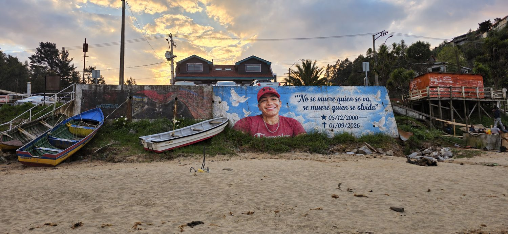
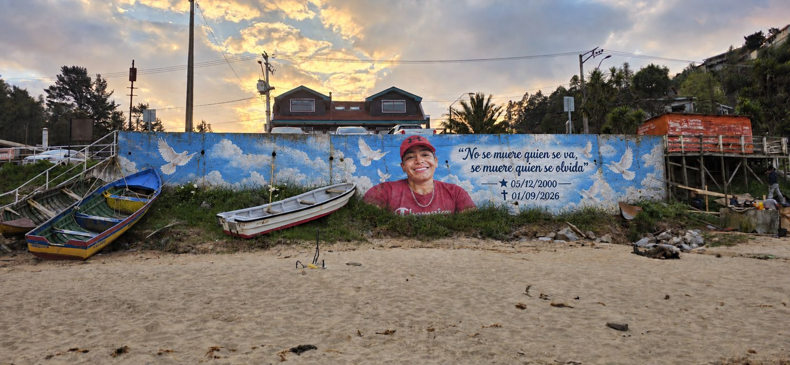
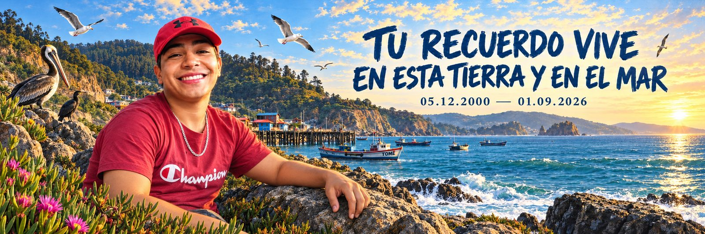

★ 05.12.2000 — ✝ 01.09.2026

*"No se muere quien se va, se muere quien se olvida."*

| Cotización | COT-2026-09-ITA |
|---|---|
| **Presentado a** | Familia de Ítalo |
| **Lugar** | Muro de la caleta, Coliumo — Tomé, Región del Biobío |
| **Fecha de emisión** | 10 de septiembre de 2026 |
| **Validez** | 30 días corridos |
| **Moneda** | Pesos chilenos (CLP) |

---

## Antes de los números

Este no es un muro cualquiera. Es el primero que se ve al bajar a la playa y el último que queda encendido cuando el sol se esconde detrás de la península. Los botes descansan apoyados en él. La gente de la caleta pasa por delante todos los días, sin proponérselo.

Un mural ahí no decora una pared: instala un lugar. Por eso las tres propuestas no se diferencian solo en cuánta superficie se pinta, sino en cuánto del muro empieza a hablar.

Las tres mantienen lo esencial: el retrato de Ítalo, su frase y sus fechas.

---

## Lectura del muro

Muro de hormigón prefabricado, a nivel de suelo, frente al mar abierto. Conserva pintura anterior desgastada y presenta el ataque normal del salitre en la zona baja. No requiere andamio.

La exposición marina es el dato técnico que manda: sin sellado previo y sin barniz de protección UV anti-salitre, cualquier mural en ese muro pierde color en una temporada. Los tres valores de esta cotización incluyen ese tratamiento.

### Ficha técnica

| Dato | Detalle |
|---|---|
| Superficie | Hormigón prefabricado, con pintura previa parcial |
| Largo aproximado | 18 – 20 m |
| Alto visible aproximado | 1,8 – 2,0 m |
| Superficie total estimada | 32 – 40 m² |
| Exposición | Exterior, frente al mar (sol directo, viento, salitre) |
| Acceso | A nivel de suelo, sin andamio |
| Técnica propuesta | Acrílico de exterior + aerosol, sellado y barniz UV |

*Las medidas son estimadas sobre las fotografías entregadas. La medición definitiva se toma en la visita técnica y no modifica los valores de esta cotización.*

---

# OPCIÓN 1 — RETRATO Y PALABRA

## Media superficie pintada · $750.000

Se interviene el paño donde vive el retrato. Ítalo, la frase y las fechas sobre un cielo con palomas. El resto del muro queda como está hoy, con sus pinturas anteriores.

Es la propuesta más directa: concentra toda la fuerza en un punto y deja el muro tal como la caleta lo conoce.

### Incluye

- Retrato de Ítalo pintado desde la fotografía entregada por la familia
- Frase *"No se muere quien se va, se muere quien se olvida"*
- Fechas con estrella y cruz
- Cielo, nubes y palomas en el paño intervenido
- Limpieza, sellado y base del área a pintar
- Barniz de protección UV anti-salitre
- Registro fotográfico del resultado

### Ficha

| Opción 1 · Retrato y palabra | Media superficie |
|---|---|
| **Superficie a intervenir** | 16 – 20 m² (aprox. la mitad del muro) |
| **Jornadas estimadas** | 3 |
| **Técnica** | Acrílico de exterior + aerosol |
| **Entrega** | 4 fotografías en alta resolución |
| **Valor** | **$750.000** |

---

# OPCIÓN 2 — CIELO COMPLETO

## Toda la superficie pintada · $1.250.000

El mismo retrato y la misma frase, pero ahora el cielo se toma el muro entero. Las palomas cruzan de un extremo al otro y las pinturas antiguas quedan cubiertas.

El muro deja de ser un fragmento pintado dentro de una pared vieja y pasa a ser una sola pieza, continua, que se lee completa desde la arena.

### Incluye

Todo lo de la Opción 1, más:

- Cielo, nubes y palomas en la totalidad del muro
- Limpieza, sellado e imprimación del muro completo
- Ajuste de composición para dejar el retrato en el punto de mayor visibilidad desde la playa
- Barniz de protección UV anti-salitre en toda la superficie
- Registro fotográfico ampliado: resultado y contexto de la caleta

### Ficha

| Opción 2 · Cielo completo | Superficie completa |
|---|---|
| **Superficie a intervenir** | 32 – 40 m² (muro completo) |
| **Jornadas estimadas** | 5 |
| **Técnica** | Acrílico de exterior + aerosol |
| **Entrega** | 6 fotografías en alta resolución |
| **Valor** | **$1.250.000** |

---

# OPCIÓN 3 — COLIUMO

## Mural completo, detallado y territorial · $2.500.000

Aquí el muro deja de hablar solo de una ausencia y empieza a hablar del lugar donde esa vida ocurrió.

Ítalo aparece en su territorio: la costa de Coliumo, los roqueríos, los botes de la caleta, la península recortada contra el atardecer, las aves que viven en esas rocas. La doca en flor abriéndose en la parte baja, donde el mural se junta con la tierra. Y la frase cambia de registro:

*"Tu recuerdo vive en esta tierra y en el mar."*

Esta es la propuesta que convierte el muro en un punto de la caleta —algo que la gente para a mirar y que se fotografía sola. Es también la única que se desarrolla con boceto a color previo, aprobado por la familia antes de tocar el muro.

### Incluye

Todo lo de la Opción 2, más:

- Paisaje de Coliumo pintado en detalle: costa, roqueríos, palafitos y botes de la caleta con sus nombres
- Fauna del lugar: pelícanos, cormoranes, gaviotas
- Doca en flor en la franja baja del mural
- Atardecer sobre la península, con trabajo de luz, degradados y reflejos en el agua
- Tipografía integrada al paisaje, no sobrepuesta
- Retrato de Ítalo con mayor nivel de detalle en piel, tela y expresión
- Boceto a color previo para aprobación de la familia
- Doble capa de barniz de protección UV anti-salitre
- Registro fotográfico completo + video timelapse del proceso

### Ficha

| Opción 3 · Coliumo | Mural completo y detallado |
|---|---|
| **Superficie a intervenir** | 32 – 40 m² (muro completo, alta densidad de detalle) |
| **Jornadas estimadas** | 8 |
| **Técnica** | Técnica mixta: acrílico de exterior, aerosol y pincel fino |
| **Entrega** | 10 fotografías en alta resolución + video del proceso |
| **Valor** | **$2.500.000** |

---

## Comparación

| Alcance | Opción 1 | Opción 2 | Opción 3 |
|---|---|---|---|
| Superficie pintada | Mitad del muro | Muro completo | Muro completo |
| Retrato de Ítalo | Sí | Sí | Sí, con mayor detalle |
| Frase y fechas | Sí | Sí | Sí, integrada al paisaje |
| Cielo y palomas | Solo en el paño | En todo el muro | Integrado al paisaje |
| Paisaje de Coliumo | — | — | Sí |
| Fauna del lugar | — | — | Sí |
| Boceto a color previo | — | — | Sí |
| Barniz de protección | Sí | Sí | Doble capa |
| Video del proceso | — | — | Sí |
| Jornadas | 3 | 5 | 8 |
| **Valor** | **$750.000** | **$1.250.000** | **$2.500.000** |

---

## Condiciones comerciales

### Forma de pago

50% al confirmar el proyecto y 50% al terminar, antes de la entrega de las fotografías en alta resolución.

El anticipo cubre materiales, preproducción y boceto. En la Opción 3 el pago puede dividirse en tres: 50% al inicio, 25% a mitad de ejecución y 25% al cierre.

### Incluido en los tres valores

- Materiales completos (pintura, aerosol, sellador, barniz, insumos)
- Traslado dentro de la Región del Biobío
- Preparación del muro
- Registro fotográfico del resultado

### No incluido

- Reparación estructural del hormigón (fisuras o desprendimientos) si aparece en la visita técnica
- Andamio o equipo especial, en caso de que el muro lo requiera
- Cambios de concepto una vez aprobado el boceto

### Clima

Es trabajo de exterior frente al mar. Lluvia, viento fuerte o marejada obligan a reprogramar jornadas. Las fechas se acuerdan con holgura y se informa día a día.

### Validez

30 días corridos desde la emisión. Valores en pesos chilenos. Se emite boleta al cierre del proyecto.

---

## Proceso

1. **Visita técnica** — medición real, estado del hormigón, luz y horarios de trabajo. Sin costo ni compromiso.
2. **Boceto** — propuesta a color sobre la fotografía del muro. Se aprueba por escrito antes de comprar materiales.
3. **Anticipo y materiales** — se confirma fecha de inicio.
4. **Preparación del muro** — limpieza, sellado y base.
5. **Ejecución** — jornadas según la opción elegida, con foto de avance al cierre de cada día.
6. **Barniz y entrega** — protección final, fotografías en alta resolución y recepción con la familia.

---

## Recomendación

Las tres opciones son honestas y las tres se ejecutan con el mismo estándar. La diferencia real está en el alcance.

Si el presupuesto lo permite, la Opción 3 es la que le hace justicia al lugar: deja a Ítalo dentro de su caleta y no sobre un fondo. Si la decisión es la Opción 1, se ejecuta con la misma dedicación —solo cambia cuánto muro se toma.

Si el presupuesto es ajustado, se reduce el alcance. Nunca la calidad de lo que se hace.
